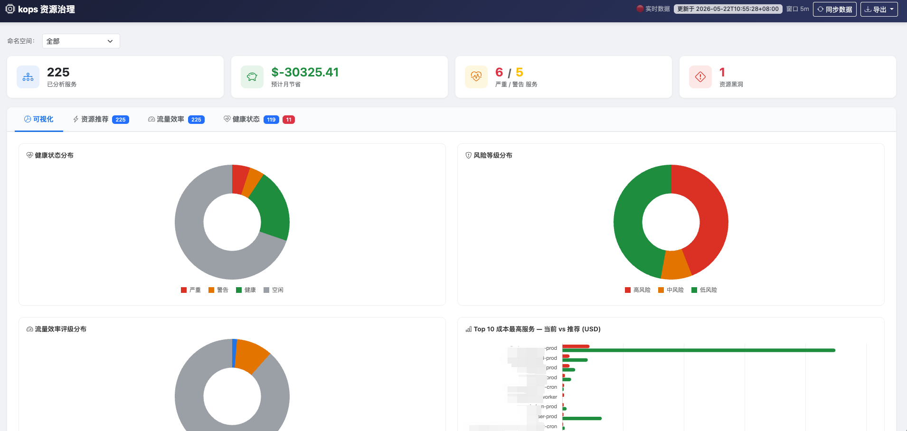

中文 | [English](README_EN.md)


# kops

`kops` 是一个面向 Kubernetes 的资源治理和 FinOps CLI，基于 Prometheus 指标生成容量建议、健康诊断和成本分析。



# 依赖

- kube-prometheus-stack v55.5
- traefik 2.11.2

## 目录

- `cmd/`: Cobra 命令入口
- `pkg/advisor/`: 资源建议、效率分析、健康检查引擎
- `pkg/algorithm/`: 成本与评分算法 wrapper
- `pkg/config/`: 配置类型别名
- `pkg/model/`: 领域类型别名
- `internal/app/analyze/`: 统一分析编排
- `internal/domain/`: 领域类型定义
- `internal/platform/`: Prometheus 采集、定价、配置加载
- `docs/`: 设计、使用和产品文档

## 常用命令

```bash
go build -o kops .
go test ./...

# 一体化分析（资源建议 + 效率 + 健康）:
./kops analyze --config config.yaml
./kops analyze --config config.yaml -o markdown
./kops analyze -n prod -d 5m -t 0.02
```

## 文档

- 文档导航: [docs/README.md](docs/README.md)
- 快速开始: [docs/guides/quickstart.md](docs/guides/quickstart.md)
- 算法说明: [docs/reference/advisor-algorithm.md](docs/reference/advisor-algorithm.md)
- 健康模块: [docs/reference/health.md](docs/reference/health.md)
- 产品文档: [docs/product/prd.md](docs/product/prd.md)
