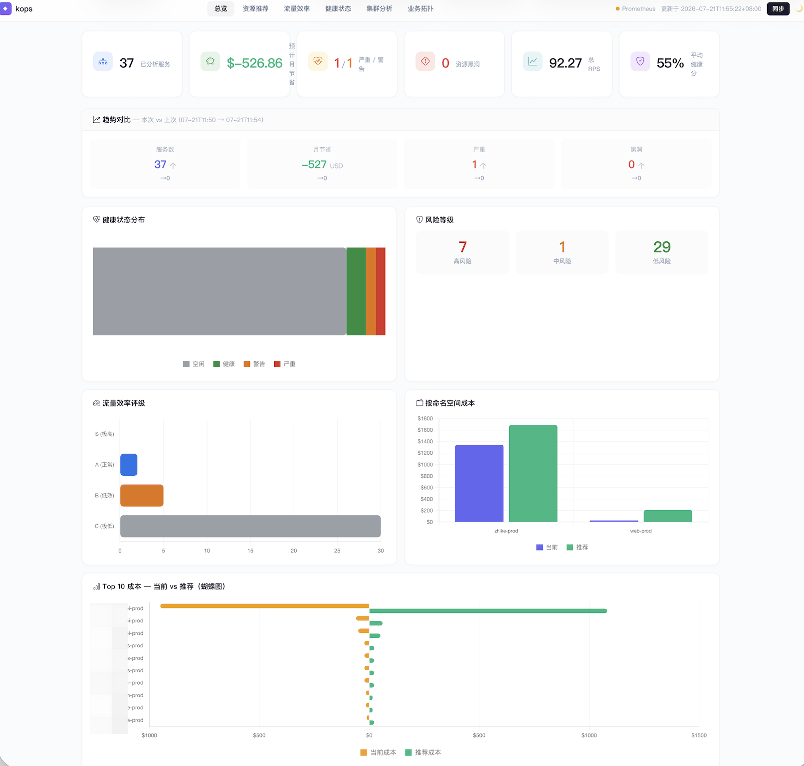
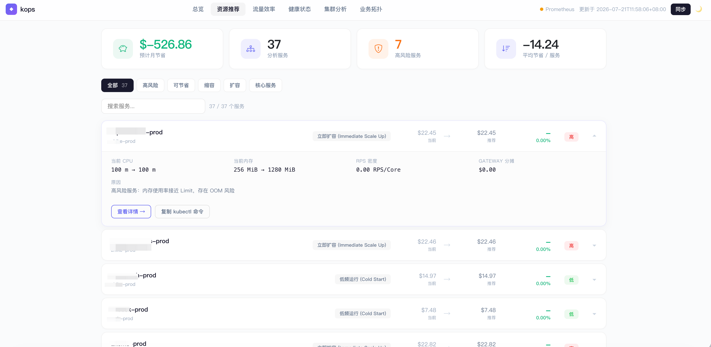
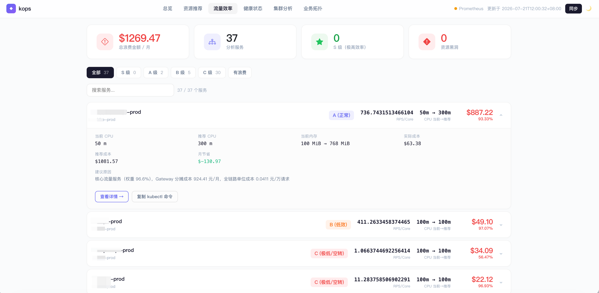
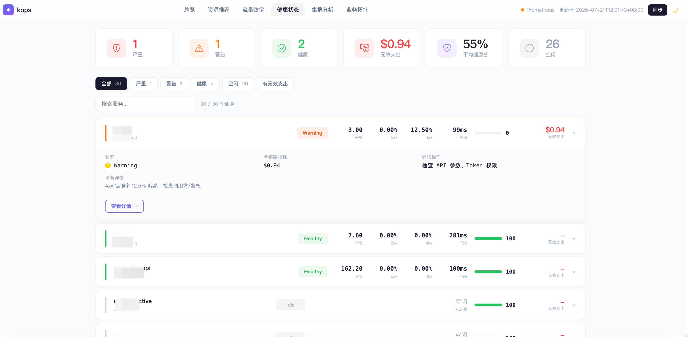
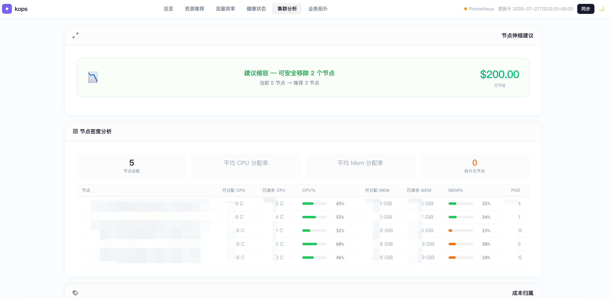
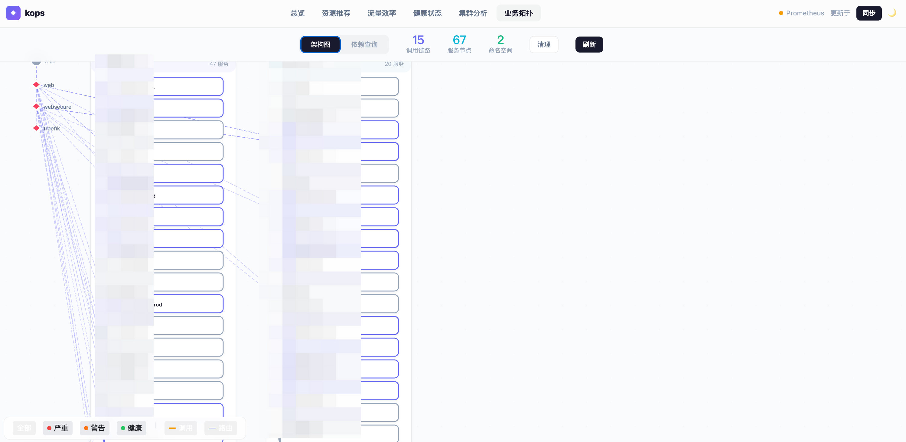
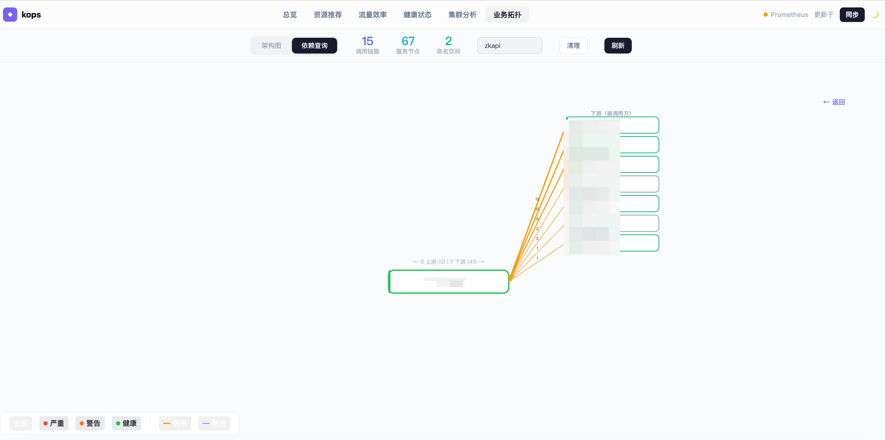

中文 | [English](README_EN.md)


# kops

`kops` 是一个面向 Kubernetes 的资源治理和 FinOps CLI，基于 Prometheus 指标生成容量建议、健康诊断和成本分析。



## 截图

<div style="display:flex;flex-wrap:wrap;gap:8px">
  
  
  
  
  
  
  
</div>

## 依赖

- kube-prometheus-stack v55.5
- traefik 2.11.2

## 功能

### CLI 分析

```bash
# 一体化分析（资源建议 + 效率 + 健康）
./kops analyze --config config.yaml
./kops analyze --config config.yaml -o markdown
./kops analyze -n prod -d 5m -t 0.02
```

### Web Dashboard

```bash
# 启动 Web 仪表盘
./kops serve --config config.yaml

# 自定义端口
./kops serve --config config.yaml -p 9090
```

访问 `http://localhost:8080`：

| 页面 | URL | 功能 |
|------|-----|------|
| 总览 | `/` | 6 张图表 + 统计卡片 + 趋势对比 | [📷](docs/img/总览.png) |
| 资源推荐 | `/recommendations` | 节省优先卡片 + 成本对比 + kubectl 命令 | [📷](docs/img/资源推荐.png) |
| 流量效率 | `/efficiency` | 流量密度 S/A/B/C 评级 + 资源黑洞 | [📷](docs/img/流量效率.png) |
| 健康状态 | `/health` | Critical/Warning/Healthy/Idle + 评分条 | [📷](docs/img/健康状态.png) |
| 集群分析 | `/cluster` | 节点伸缩 + 利用率色条 + 成本归属 | [📷](docs/img/集群分析.png) |
| 业务拓扑 | `/topology` | 架构图 + 依赖查询（服务调用链） | [📷](docs/img/业务拓扑-架构图.png) [📷](docs/img/业务拓扑图-依赖查询.png) |
| 服务详情 | `/service/:ns/:name` | 成本趋势、HPA 建议、成本预测、异常检测 | |

Dashboard 特性：
- 暗色模式（全页面适配）、列排序、筛选芯片、行展开详情
- HPA 伸缩建议（基于 P10/P50/P95 流量分析）
- 成本预测（7 天线性回归） + 异常检测（均值 ± 2σ）
- Pod 稳定性报告（重启次数 / OOMKill / CrashLoopBackOff）
- 入口流量排行 + 慢请求分析（P99）+ Jaeger Trace 链接
- Prometheus 连通性状态指示器
- kubectl 命令一键复制、CSV/JSON 导出

## 目录

```
cmd/                          # Cobra 命令入口
internal/
├── app/
│   ├── analyze/              # 统一分析编排
│   ├── common/               # 共享工具
│   └── serve/                # Web 服务 + 模板 + 缓存 + 告警
├── domain/                   # 领域类型 (advisor/health/metrics)
└── platform/
    ├── collector/            # Prometheus + Traefik + Jaeger + K8s 采集
    ├── config/               # 配置加载与验证
    ├── pricing/              # 成本模型 + 推荐算法
    └── storage/              # 拓扑图本地存储
pkg/
├── advisor/                  # 资源建议、效率分析、健康检查引擎
├── algorithm/                # 成本与评分算法
├── config/                   # 配置类型别名
└── model/                    # 领域类型别名
docs/                         # 设计文档
```

## 常用命令

```bash
go build -o kops .
go test ./...

# 一体化分析:
./kops analyze --config config.yaml
./kops analyze --config config.yaml -o markdown
./kops analyze -n prod -d 5m -t 0.02
```

## 配置

```yaml
# config.yaml
namespaces:
  - web-prod
  - demo-prod

prometheus:
  address: "https://prom.example.com"
  timeout: 30s

governance:
  cpu_step: 50
  memory_step: 128
  min_cpu: 100
  min_memory: 128
  target_utilization: 0.8
  memory_target_utilization: 0.8   # 新增：内存利用率目标
  black_hole_cost_threshold: 100.0

cost:
  price: 1197.42
  cpu_cores: 16
  memory_gb: 64

gateway_cost:
  price: 478.47
  count: 3

# 拓扑图本地存储
storage:
  path: "./data"

# 分布式链路追踪（服务调用链数据源）
jaeger:
  address: "http://jaeger.example.com"
  timeout: 30s
```

## API 端点

| 端点 | 说明 |
|------|------|
| `GET /api/analysis` | 全量分析 JSON |
| `GET /api/trend` | 趋势对比 |
| `GET /api/cluster/nodes` | 节点密度 |
| `GET /api/cluster/scaling` | 伸缩建议 |
| `GET /api/cost-attribution` | 成本归属 |
| `GET /api/forecast/:ns/:name` | 资源预测 |
| `GET /api/service/:ns/:name/recommendation` | 单服务推荐 |
| `GET /api/service/:ns/:name/timeseries` | 单服务时间序列 |
| `GET /api/service/:ns/:name/hpa` | HPA 伸缩建议 |
| `GET /api/service/:ns/:name/predict` | 成本预测 + 异常检测 |
| `GET /api/ingress-ranking` | 入口流量排行 |
| `GET /api/slow-requests` | 慢请求分析（P99） |
| `GET /api/pod-stability` | Pod 稳定性报告 |
| `GET /api/topology/graph` | 拓扑图数据 |
| `POST /api/topology/refresh` | 重建拓扑（从 Prometheus + Jaeger） |
| `DELETE /api/topology/cleanup` | 清理拓扑缓存 |
| `POST /api/refresh` | 刷新缓存 |
| `POST /api/config/reload` | 配置热加载 |
| `GET /api/export/csv` / `json` | 导出 |

## 文档

- 快速开始: [docs/guides/quickstart.md](docs/guides/quickstart.md)
- 算法说明: [docs/reference/advisor-algorithm.md](docs/reference/advisor-algorithm.md)
- 健康模块: [docs/reference/health.md](docs/reference/health.md)
- 术语表: [docs/GLOSSARY.md](docs/GLOSSARY.md)

## 变更记录

### v2.0 (2026-06-12)

**架构：** Dashboard 从单页面 5 Tab 重构为独立路由页面，新增 7 个 API 端点。

**修复：** Advisor 除零、Efficiency 评分异常、Health 字段缺失、Prometheus timeout 不生效、QueryRange timestamp 解析错误、pod!~ 正则引号缺失（8 处 PromQL 语法错误）等 10+ Bug。

**新增：** 节点密度分析、伸缩建议、成本归属、资源预测、趋势对比、结构化日志、API 限流、Webhook 告警、暗色模式、列排序、筛选芯片、kubectl 命令复制。

**算法：** 统一黑洞检测（利用率+流量）、统一成本口径（含 Gateway 分摊）、统一密度单位（RPS/Core）、内存利用率目标、Pod 精准匹配排除 consumer/cron/job/worker。

### v2.1 (2026-07)

**新增：** 业务拓扑页面——服务调用链路架构图 + 依赖查询。基于 Jaeger trace 数据自动提取服务间 parent→child 调用关系，匹配到 K8s Deployment 节点，支持命名空间容器分组、健康筛选、图层切换。支持 Jaeger `/api/dependencies` 不可用时从 traces 自动采集依赖。

详见 [CHANGELOG.md](CHANGELOG.md)
